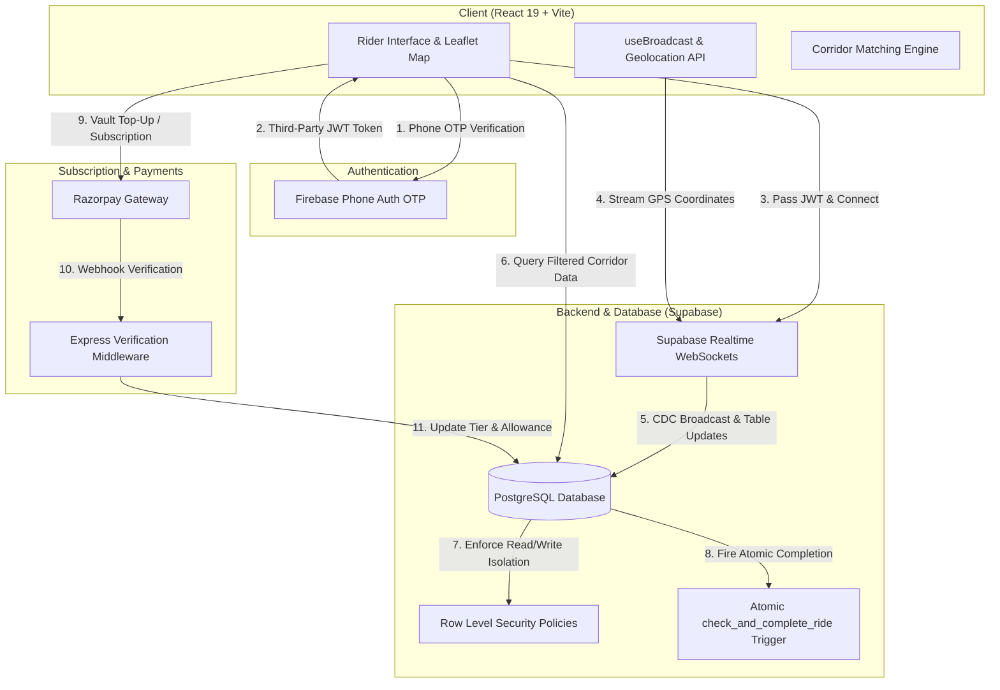
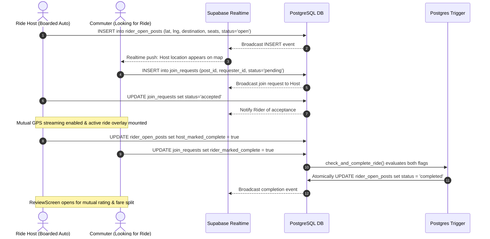

# System Architecture & Technical Specification

CoPassage relies on a hybrid serverless architecture leveraging **React 19**, **Firebase Phone Auth**, and **Supabase (PostgreSQL with Row-Level Security & Realtime WebSockets)**, augmented with an Express Razorpay subscription verification service.

---

## 1. System Architecture Diagram

---

## 2. Core Components & Responsibilities

| Component / Layer | Technology | Primary Responsibility |
| :--- | :--- | :--- |
| **Frontend Shell** | React 19, Vite, Tailwind CSS 4 | Responsive UI, state management, contextual location permissions, scenario simulation. |
| **Mapping & Geospatial** | Leaflet, OpenStreetMap, `@vis.gl/react-google-maps` | Dynamic map rendering, pulsing real-time pins, visual corridor radius circles (250m–1km). |
| **Authentication** | Firebase Phone Auth | SMS OTP verification generating third-party JWT tokens for user identity. |
| **Database & API** | Supabase (PostgreSQL) | Relational storage for open posts, requests, chat, and ratings with strict RLS enforcement. |
| **Real-time Engine** | Supabase Realtime (CDC) | Broadcast channels streaming host GPS locations, join requests, and chat without client polling. |
| **Business Logic & Integrity** | PostgreSQL Triggers (`SECURITY DEFINER`) | Atomic mutual ride completion, heartbeat staleness sweeps, and emergency audit trail. |
| **Payments & Vault** | Razorpay SDK & Node.js Express Middleware | Subscription plan checkout, detour surcharge calculation, and commuter vault management. |

---

## 3. End-to-End Data Flow

---

## 4. Mathematical Geodetic Engine & Corridor Matching

Because CoPassage operates at zero marginal cost without relying on expensive routing APIs (e.g. Google Directions API), corridor matching is computed in client-side TypeScript via spherical trigonometry:

### The Haversine Distance Formula
Used to determine great-circle distance between two geodetic coordinates:
$$\Delta\phi = \phi_2 - \phi_1, \quad \Delta\lambda = \lambda_2 - \lambda_1$$
$$a = \sin^2\left(\frac{\Delta\phi}{2}\right) + \cos(\phi_1)\cos(\phi_2)\sin^2\left(\frac{\Delta\lambda}{2}\right)$$
$$d = 2 R \cdot \text{atan2}\left(\sqrt{a}, \sqrt{1 - a}\right) \quad (\text{where } R = 6371\text{ km})$$

### Forward Azimuth Bearing & Angular Alignment
Forward bearing $\theta$ from coordinate point $(lat_1, lng_1)$ to $(lat_2, lng_2)$ is calculated as:
$$\theta = \text{atan2}\left(\sin(\Delta\lambda)\cos(\phi_2), \cos(\phi_1)\sin(\phi_2) - \sin(\phi_1)\cos(\phi_2)\cos(\Delta\lambda)\right)$$

Commuter routes are classified as matching if:
1. **Origin Proximity**: Distance from Commuter to Host $\le 2.0\text{ km}$ (scoped down to $250\text{m} - 1.0\text{km}$ based on subscription tier).
2. **Directional Bearing Difference**: $|\Delta\theta| \le 25^\circ$.
3. **Destination Proximity**: Distance between destinations $\le 0.5\text{ km}$ ($500\text{m}$).

---

## 5. Security, Row-Level Security (RLS), & Atomic Completion

1. **Third-Party JWT Integration**: Supabase verifies Firebase JWTs via RS256 public keys. RLS policies match `auth.uid()::text` against table columns.
2. **Privacy Enforcement**:
   - Requester coordinates in `join_requests` are enforced as `NULL` until the host marks the request `'accepted'`.
   - Continuous GPS history is discarded after ride termination; only ride endpoints are retained for trip logs.
3. **Atomic Mutual Ride Completion**:
   - Neither party has permission to unilaterally finalize a ride.
   - The Host updates `rider_open_posts.host_marked_complete = true`.
   - The Co-rider updates `join_requests.rider_marked_complete = true`.
   - A `SECURITY DEFINER` PostgreSQL trigger evaluates both flags across both tables and atomically transitions the ride status to `'completed'`.
4. **Emergency SOS Direct-Write**:
   - Tapping the SOS button immediately writes GPS coordinates, user ID, and timestamp to `rider_sos_events` **before** opening device emergency hotlines, guaranteeing an immutable audit trail even if connectivity drops.
