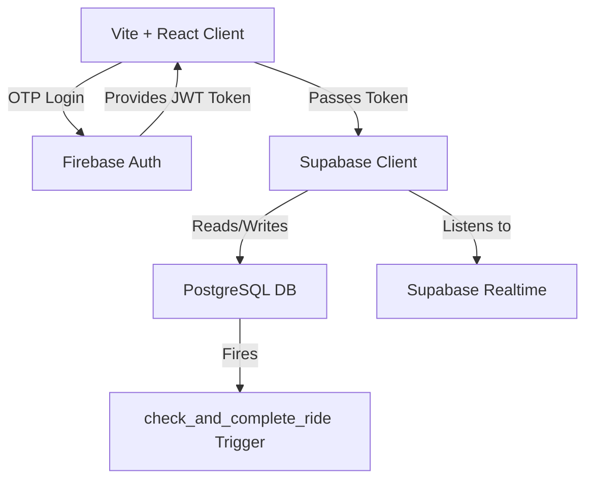

# Architecture

CoPassage relies on a strictly serverless architecture leveraging Firebase and Supabase, with heavy utilization of PostgreSQL Row-Level Security (RLS) and Triggers to enforce business logic natively at the database level.

## System Diagram

## Core Components

| Technology | Responsibility |
|------------|----------------|
| **Vite & React** | Frontend rendering, Leaflet map integration, Geolocation `watchPosition` API handling. |
| **Firebase Auth** | Handles Phone OTP authentication and returns a JWT token. |
| **Supabase Client** | Passes the Firebase JWT token to the Supabase backend to authenticate API requests. |
| **PostgreSQL (Supabase)** | Stores all relational data. Uses Row-Level Security to isolate ride data strictly to matched participants. |
| **Supabase Realtime** | Subscribes to table updates (`rider_open_posts`, `join_requests`, `ride_messages`) to push live coordinates and chat messages to clients without polling. |

## Data Flow & Database Schema

The database consists of 5 core tables in the `public` schema:

1. **`rider_open_posts`**: Stores the active broadcast from the Host. Includes live coordinates, destination, seats, and a `host_marked_complete` flag.
2. **`join_requests`**: Stores requests from nearby commuters. Includes a `rider_marked_complete` flag. Requester coordinates are strictly hidden (`NULL`) until the Host accepts the request.
3. **`ride_messages`**: Realtime in-ride chat table.
4. **`rider_sos_events`**: Direct-write table for SOS triggers. By writing to the DB *before* dialing hotlines, we ensure an audit trail exists even if the call fails.
5. **`rider_ratings`**: Post-ride commuter reviews.

## Mutual Completion Architecture (Security Note)

To ensure neither party can unilaterally complete a ride prematurely, the system uses a **Mutual Ride Completion Architecture**:
1. Host sets `rider_open_posts.host_marked_complete = true`.
2. Co-rider sets `join_requests.rider_marked_complete = true`.
3. A Postgres Trigger (`check_and_complete_ride`) runs with `SECURITY DEFINER` privileges upon any update to these tables. It atomically transitions the ride `status` to `'completed'` when both flags are true.

## Route Matching Logic

Because CoPassage operates at zero marginal cost without paid routing APIs (like Google Maps), matching relies on client-side and SQL heuristics:
- **Proximity**: Haversine distance from the user to the candidate must be ≤ 2km.
- **Bearing Alignment**: Forward azimuth bearing from origin→destination is computed using spherical trigonometry. Angular difference must be ≤ 25°.
