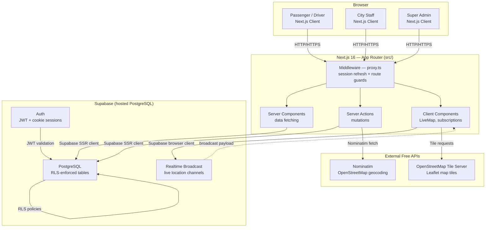

# Architecture

## System Architecture



## Components

| Component | Technology | Responsibility |
|---|---|---|
| End-User App | Next.js 16 App Router | Dashboard, find/offer rides, live tracking, SOS, issue reporting |
| City Staff Portal | Next.js 16 App Router | SOS alert triage, escalation management, staff roster, case history |
| Super Admin Panel | Next.js 16 App Router | User & role management, global match/payment overview, all escalations |
| Middleware | Next.js Middleware (`proxy.ts`) | Session cookie refresh (Supabase SSR), role-based route guards for `/app`, `/staff`, `/admin` |
| Database | Supabase / PostgreSQL | Stores all persistent data; Row Level Security enforces per-role data isolation |
| Auth | Supabase Auth | JWT-based sessions via HTTP-only cookies; `super_admin`, `city_staff`, `user` roles |
| Realtime | Supabase Realtime Broadcast | Streams driver GPS coordinates to passenger without writing to disk |
| Map | Leaflet + react-leaflet | Interactive map rendered in the browser; dynamically imported (SSR disabled) |
| Map Tiles | OpenStreetMap | Free tile server via `{s}.tile.openstreetmap.org`; no API key required |
| Geocoding | Nominatim (OpenStreetMap) | Converts address text to `lat/lng` on ride offer and broadcast creation |
| Distance Calc | Haversine formula (client-side) | Sorts Find Passengers feed by distance from driver's GPS; runs in-browser after DB fetch |

## Data Flow — Key Scenarios

### Ride Offer with Geocoding
1. Driver submits Offer Ride form (origin text, destination text, city, time, seats, price)
2. `createRideOffer` Server Action calls `geocodeAddress(origin, city)` and `geocodeAddress(destination, city)` in parallel via Nominatim
3. Coordinates (`origin_lat/lng`, `dest_lat/lng`) are stored alongside the offer in `ride_offers`
4. Row is instantly visible to searching passengers via the `ride_offers: public can read active` RLS policy

### Passenger Broadcast + Proximity Feed
1. Passenger submits Broadcast Ride form → `createRideBroadcast` geocodes and inserts into `ride_broadcasts`
2. Driver opens Find Passengers → `searchBroadcasts(city)` returns active broadcasts for that city
3. Browser requests driver's GPS via `navigator.geolocation.getCurrentPosition`
4. `calculateDistance` (Haversine) computes km to each broadcast's `origin_lat/lng`
5. Broadcasts re-sorted in-browser; if GPS resolves after the initial fetch, a React effect triggers a re-sort automatically

### Match Creation + Live Tracking
1. Driver accepts a seat request → `acceptRequest` Server Action:
   - Updates `ride_requests.status = 'accepted'`
   - Inserts a row into `matches` (returns `match.id`)
   - Decrements `ride_offers.available_seats`
2. Driver's My Rides card shows **"Start Ride"** → navigates to `/app/drive/[matchId]`
3. Driver page subscribes to channel `live-location-{matchId}` via Supabase Realtime and calls `navigator.geolocation.watchPosition`
4. Each GPS update is sent as a Broadcast payload `{ lat, lng }` — never written to the database
5. Passenger's `/app/ride/[matchId]` page subscribes to the same channel; each payload updates `driverLoc` state → `LiveMap` re-renders with a new marker position

## Database Schema

```
profiles         — user accounts, roles, driver verification status
vehicles         — registered driver vehicles
ride_offers      — driver-posted routes with coords, seats, price
ride_requests    — passenger seat requests on an offer
matches          — confirmed driver+passenger pairings
ride_broadcasts  — passenger-initiated "I need a ride" posts with coords
payments         — payment records linked to matches
escalations      — user-reported issues (visible to city staff + admin)
sos_alerts       — emergency alerts with GPS coords (visible to city staff)
```

## Row Level Security Summary

Every table has RLS enabled. Key policies:

| Table | Rule |
|---|---|
| `profiles` | Users read/update their own row; super_admin reads/updates all |
| `ride_offers` | Any authenticated user reads active offers; only driver can write own offers |
| `ride_requests` | Rider sees own requests; driver sees requests on their offers |
| `ride_broadcasts` | Any authenticated user reads active broadcasts; only passenger can write own |
| `matches` | Driver and rider see their own matches; staff/admin see city-scoped or all |
| `escalations` | Staff see city-scoped; super_admin sees all; users can insert |
| `sos_alerts` | User can insert and see own; staff/admin see city-scoped or all |

## Security Notes

- All credentials stored in environment variables; `.env.local` is gitignored
- Supabase anon key is safe to expose (restricted by RLS); service-role key is server-only
- No user PII beyond name and email is stored
- Session cookies are HTTP-only (managed by Supabase SSR); no JWT in `localStorage`
- Nominatim requests include a `User-Agent` header identifying the project as required by OSM policy

## Scalability Notes

The current architecture is suitable for a hackathon MVP and small production load:

- **Next.js** is stateless and can be horizontally scaled or deployed to Vercel edge functions with no code changes
- **Supabase Realtime Broadcast** is ephemeral (not persisted) — it scales with Supabase's own infrastructure, not with the number of matches
- **Geocoding bottleneck:** Nominatim has a 1 req/sec rate limit for non-registered usage; a production app would batch geocoding or switch to a paid provider (Google Maps, Mapbox)
- **Haversine client-side sort** works at city scale (hundreds of rides); PostGIS `ST_Distance` queries would be needed for nationwide proximity search
